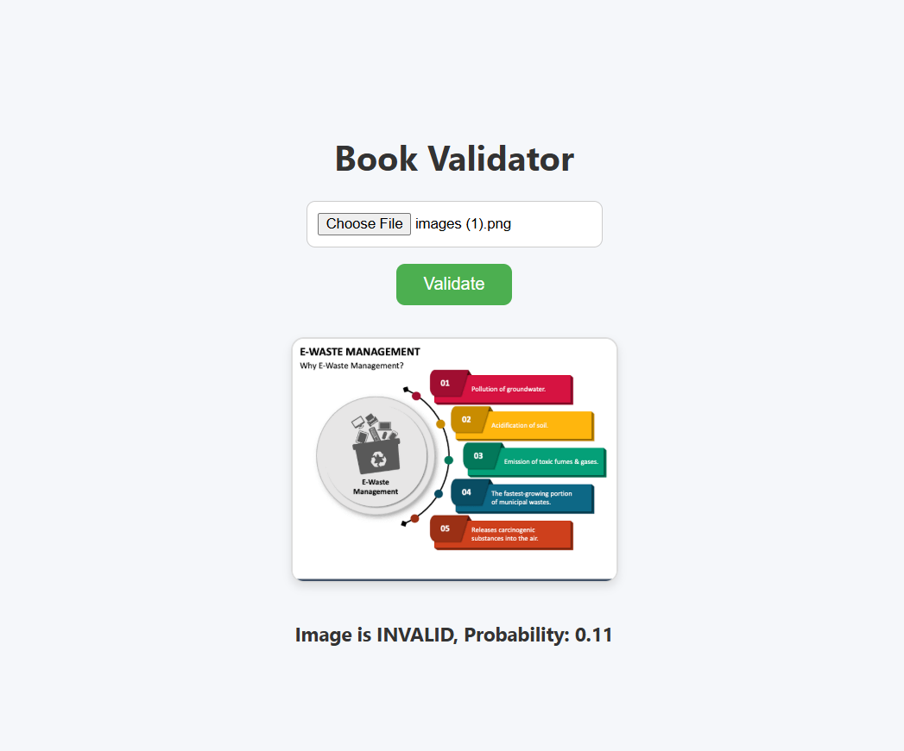

# Book Image Validator

## Overview

The **Book Image Validator** is an automated system designed to classify book images as **VALID** or **INVALID**. The primary purpose of this project is to assist **book-selling platforms** by automatically detecting valid book images, eliminating the need for manual validation by an admin.

For example, instead of a platform admin manually checking if each uploaded book image is legitimate, this system uses a trained **MobileNetV2-based deep learning model** to verify images in real-time.

---

## Features

- Automatically classifies images as **VALID** or **INVALID**.
- Uses **MobileNetV2** pre-trained on ImageNet for feature extraction.
- Simple **Flask backend** for API predictions.
- Supports **image uploads via frontend** (with preview and instant feedback).
- Can handle **base64-encoded images** for API integration.

---

## How It Works

1. A user uploads a book image via a **web interface**.
2. The frontend converts the image to a format suitable for the backend (raw file or Base64).
3. The Flask backend receives the image and preprocesses it:
   - Resizes to **224x224 pixels**.
   - Converts to RGB.
   - Applies **MobileNetV2 preprocessing**.
4. The preprocessed image is passed through the trained **MobileNetV2 model** with a custom classification head.
5. The model outputs a **probability score**:
   - Above a threshold → **VALID**
   - Below the threshold → **INVALID**
6. The prediction is sent back to the frontend and displayed to the user.

---

## 📸 Screenshots

  
  

## 📁 Dataset Setup

This project does **not** include the training images due to size and licensing reasons.

To train or test the model, create the following directory structure
inside the project root:

images/
├── train/
│   ├── valid/
│   │   ├── img1.jpg
│   │   └── ...
│   └── invalid/
│       ├── img1.jpg
│       └── ...
├── val/
│   ├── valid/
│   │   ├── img1.jpg
│   │   └── ...
│   └── invalid/
│       ├── img1.jpg
│       └── ...

- `valid/`   → images of real books (correct listings)
- `invalid/` → random / non-book / incorrect images

License
This project is open-source and available under the MIT License.
